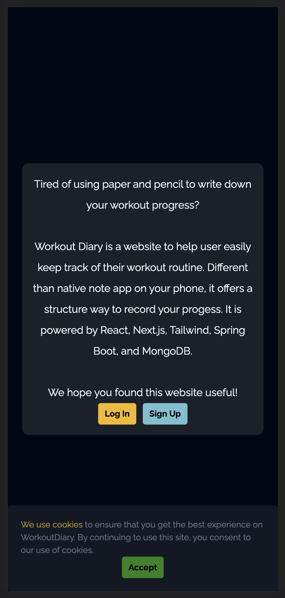
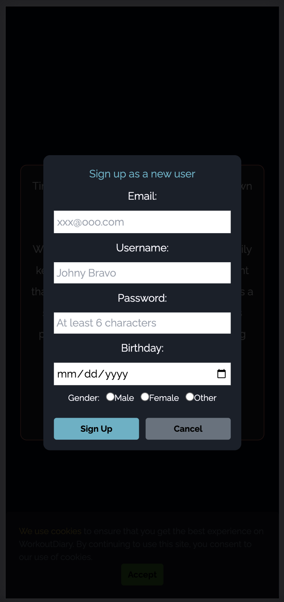
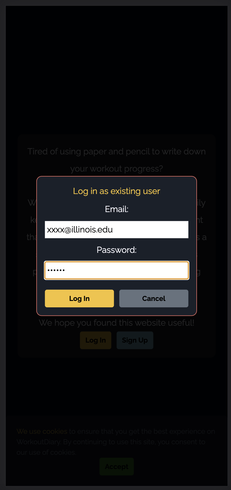
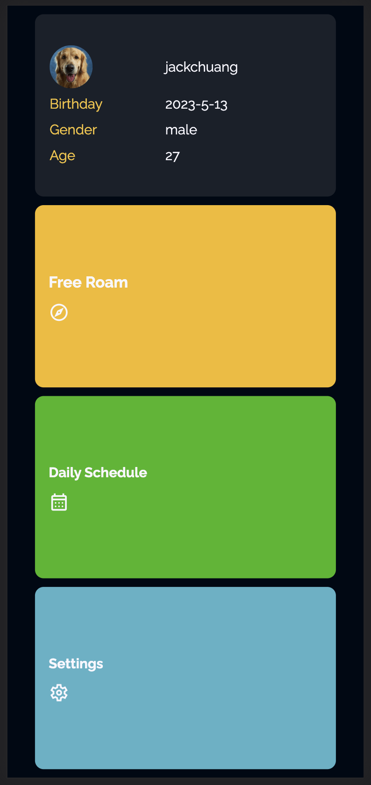
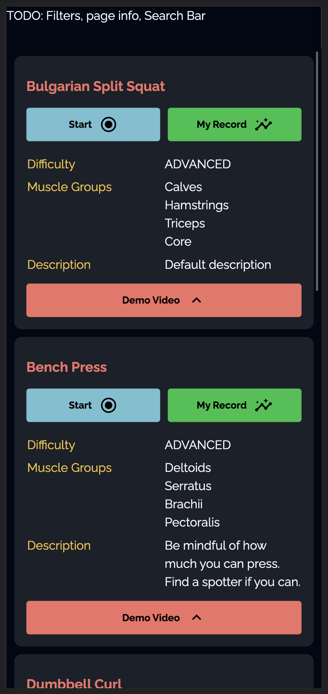
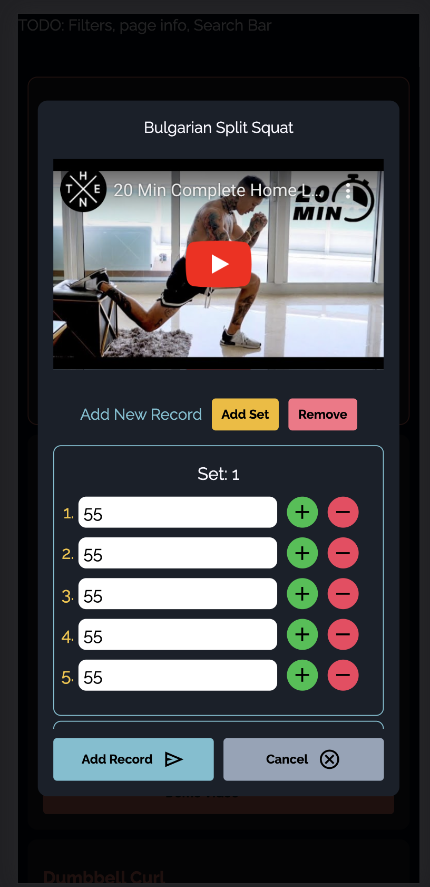

<a href="http://jacktogon.com/workoutdiary">http://jacktogon.com/workoutdiary  I am poor student, so my server is pretty slow.</a>

## Description
This repo is dedicated to the website ***WorkoutDiary***—a website that helps you easily keep track of your workout routine. 

# READ THIS
If you just clone the repository, **it will not work**. This is just a small chunk of the whole projects. It is a free tool for everyone; however, it is not open source. ESPECIALLY, I recently found out some of the companies I applied to copy this repo instead of just hiring me.  

## Screenshots from Nextjs
| | | |
| --- | --- | --- |
|  |  |  |
|  |  |  |

### powered by 
- `Frontend`: 
  1. **Next.js**
  2. **React**
  3. **React-query**
  4. **Tailwind CSS**
  5. **D3.js**

- `Backend`:
  1. **Spring Boot**
  2. **MongoDB**

## Requirements
- Setup environment variables
- install npm, java 

## Color Theme
-  `#000814`
-  `#001d3d`
-  `#003566`
-  `#ffc300`
-  `#ffd60a`
-  `#fca311`
-  `#ffffff`
-  `#fdfcdc`
-  `#f07167`
-  `#48F40B`
